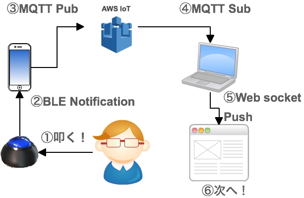
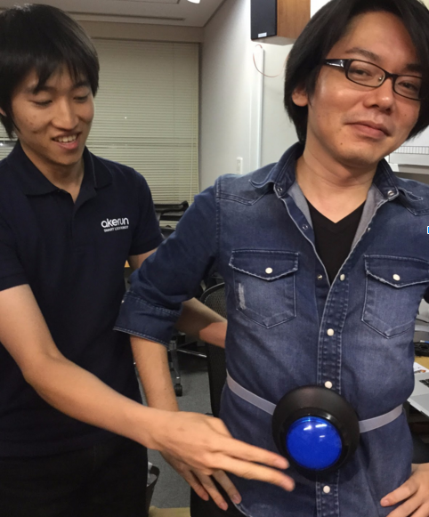
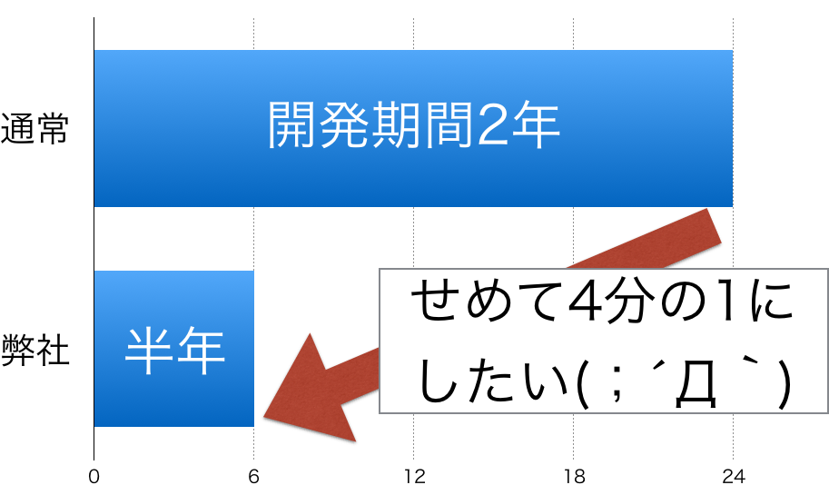
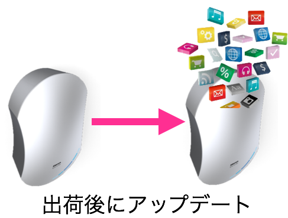
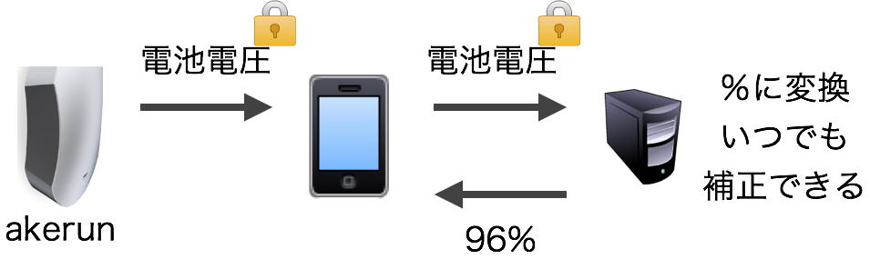
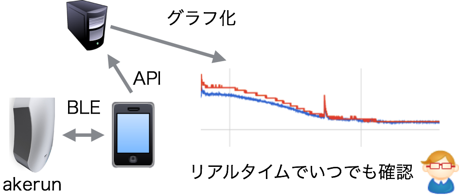
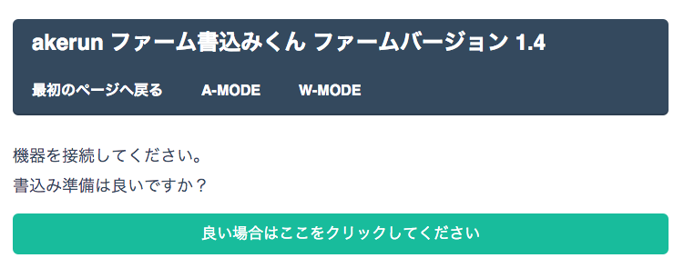

# 「IoT」は ものづくりを 加速する

TechCrunch Tokyo CTO Night 
株式会社フォトシンス CTO 本間和弘

## 株式会社フォトシンス
<!-- image ./images/wakate.png -->

- ◯創業1年, 調達総額4.7億円, IoTベンチャー
- ◯NEDO採択、多数の特許出願、若手技術者集団
- ◯ハード/ソフト両方を内製している数少ないIoTベンチャーです

## メインプロダクト
<!-- image ./images/yapc_akerun.jpg -->

- ◯スマートロック「Akerun」の開発・提供
- ◯Akerun…スマートフォンで鍵の開閉、ネットワークを介した合鍵共有

### 自己紹介
<!-- image ./images/yapc2015-01.jpg -->

- ・本間和弘 / @kazuph
- ・株式会社フォトシンス 創業メンバー CTO
- ・Webから組み込みまで幅広く開発
- ・好きなAWSは「AWS IoT」

## 実はこの発表も…「AWS IoT」を使っています！
<!-- image ./images/iot_button.jpg -->

## プレゼンボタン全体図

### 社内の自由工作で生まれたボタン

## 本題

### 本題

創業時のベンチャーが最初にすること

↓

「一刻も早くプロダクトを市場に出す！」

### ハードウェア開発期間

### どうやったら開発期間を 半年にできるのか？

## 3つの解決方法

## 解決方法 その1

「あとからでも変更可能なファームウェア設計」 でスピードアップ！

### 従来のファームウェア開発

- 製品の出荷後変更はできない
- 機能は出荷前に全部実装する必要がある

出荷後に変更できないという心理で、仕様や評価がどんどん膨れ上がる

### 弊社のIoT製品の設計

- あとからでも仕様変更できる設計へ
- 「その機能、今は必要ないよね？」と言える

### 弊社のIoT製品の設計

- デバイスの設定・制御を必ずネット越しに
- → ファーム側で計算することが大幅に減った

### 無駄な開発を省き 出荷までをスピードアップ！

## 解決方法 その2

「耐久試験の自動化」 でスピードアップ！

### 耐久試験

- Akerunは10万回の開閉試験を行った

普通にファームだけで動かしても、問題の原因特定や停止がすぐに検知できない

### 弊社の耐久試験

- iOSでAkerunのテストスクリプトを書いた
- リアルタイムに問題や停止などがわかる

### 耐久試験を自動化して スピードアップ！

## 解決方法 その3

「ハードウェア製造工程のウェブ化」でスピードアップ！

### 製品の完成後は？

Capistranoで3分でデプロイ？

とはいきません！

### 製品の「製造」が必要です！
<!-- image ./images/kojo.jpg -->

筐体作成 回路基板作成 筐体組み立て作業 ファームウェア書き込み 筐体組み込み 動作チェック 接着 ID付与 梱包 出荷・・・

この製造の工程を効率化したい！！

### 「それWeb APIでできるよ？」

### ファーム書き込みくん

Chromeに表示、ボタンを押すとファーム書込開始！それだけ！

### 工場に行かなくても問題検知!

- エラーがあればSlackへ通知
- ツール自体のオンラインアップデート

### 製造工程の自動化で管理コストも 作業時間も大幅ダウン！

## 結果
<!-- image images/kaiken2.png -->

### 結果
<!-- image images/kaiken.png -->

- 2014/09 創業
- 2015/03 記者会見で量産品でのデモ
- 2015/04 出荷開始

### 初めてのハードウェア開発

### Webのちからを ものづくり自体に組み込む

### それが僕達の「IoT」です

## ご清聴ありがとう ございました！
<!-- image images/last.jpg -->

