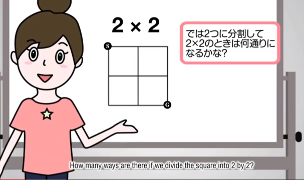
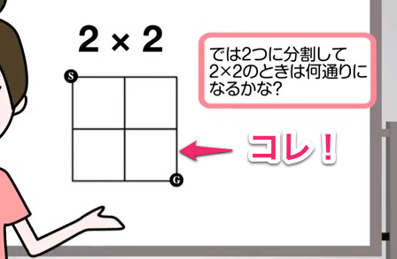
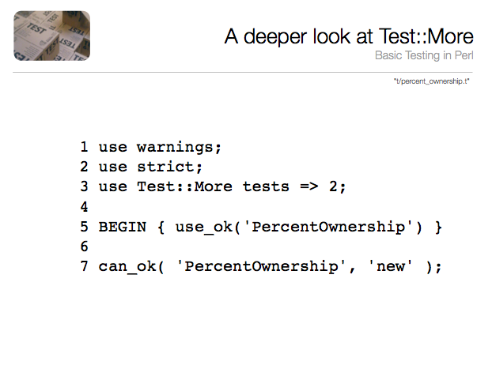
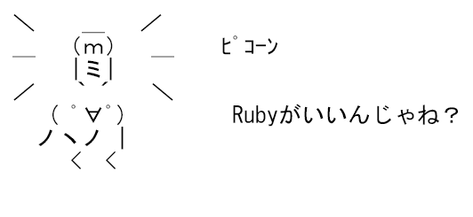
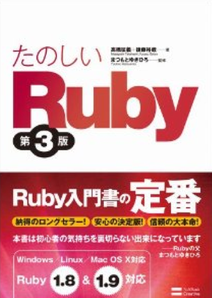

# みんなでProjectEuler in Ruby
@kazuph

2012/12/01

## 自己紹介
* ID:@kazuph
* 「かずふ」って読みます
* 株式会社ガイアックス
* 2年目エンジニア
* プログラムは大学から
* 使用言語：Perl, Objective-C, JavaScript, Java
* エディタ: Vim
* 最近はスマフォアプリつくってます。

### ところで皆さん
### ProjectEulerって
### 知ってますか！？
### ・・・
### (´・ω・｀)

## ProjectEulerとは
> 挑戦的な数学/コンピュータのプログラミング問題集で、これを解くためには数学的な洞察力以上のものが要求される。
> 数学によって、エレガントで効果的な方法にたどり着くことができるが、ほとんどの問題はコンピュータとプログラミングの能力が必要とされる。

[出展：ProjectEuler本家サイト](http://projecteuler.net)

### ふーん

### じゃあ・・・
## 「お姉さん」は知ってますか！？

[出展：『フカシギの数え方』 おねえさんといっしょ！ みんなで数えてみよう！ ](http://www.youtube.com/watch?v=Q4gTV4r0zRs)

### ( ･\`ω･´)
### で、ProjectEulerってのは
### つまるところ

## こういう問題をたくさん解くサイト

### 全206カ国
### 総参加者25万人
### 全問題数403問(増殖中)
### つまり
### お姉さんも403人！
##  増殖中！
増殖している感じの画像

### 繰り返します
### ProjectEulerとは
### 全206カ国
### 総参加者25万人
### が、
### 403人のお姉さん(増殖中)を救うProject！

# みんなでProjectEuler in Ruby
@kazuph

2012/12/01

### もとい

# Rubyでお姉さん （複数人） を救った話
@kazuph

2012/12/01

## なんでこうなった？
* Clean Coderに触発される
* 仕事はパフォーマンス(本番)
* プロのプログラマーは練習をする

### プロのプログラマーは練習をする

### 練習とかなんか部活みた〜い

### 「じゃあ、部活しよう」

### え

### 「部活」

### 突然の部活発足！！ （今年5月）
## 朝練風景(写経中)

## 写経教材
* [TDD Perl](http://assets.en.oreilly.com/1/event/12/Practical%20Test-driven%20Development%20Presentation.pdf)

### 最初Perlでやったら
### PHPer組から悲鳴が・・・
### (詳しくは懇親会で)
### やはりPerlとPHPは反発し合うのか・・・
### ならば、
## そうだRubyにしよう！

## Ruby
* 言わずと知れた国産言語
* ストレスのないプログラミング
* 「キメると気持ちいい」らし
い

### Perler, PHPerも
* 「Rubyならいいよ！」

## Ruby入門
* 一応最初にみんなで済ませました

### そして「練習」に取り組むため

### ProjectEuler始動！ （7月）

## 最初の運用
* githubにあげて解き終わったらFacebookの部屋にURLを知らせて軽くソースレビュー
* 実行時間のかかる問題は手元環境で実行して参考時間を投稿

## 
