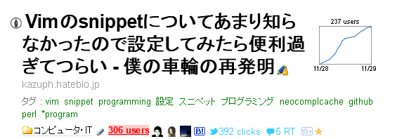
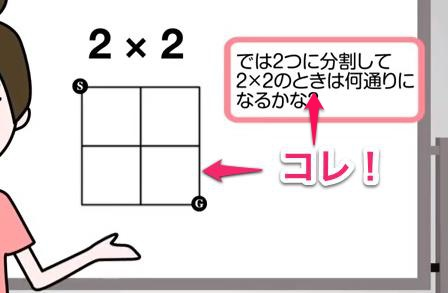

# みんなでProjectEuler in Ruby
@kazuph

2012/12/01

#### 自己紹介
### ID:kazuph
### 「かずふ」って読みます
### 2年目
## Vimの記事を書いたり


## Vim読書会に行ってdisられてきたりしている

### Vimが大好きな<br />スマフォエンジニアです！
### 続きは懇親会で！

### 突然ですが皆さん
### ProjectEulerって<br />知ってますか？
### シーン
## ProjectEulerとは
> 挑戦的な数学/コンピュータのプログラミング問題集で、これを解くためには数学的な洞察力以上のものが要求される。
> 数学によって、エレガントで効果的な方法にたどり着くことができるが、ほとんどの問題はコンピュータとプログラミングの能力が必要とされる。

[出展：ProjectEuler本家サイト](http://projecteuler.net)

### ふーん
## 「お姉さん」は知ってますか！？


[出展：『フカシギの数え方』 おねえさんといっしょ！ みんなで数えてみよう！ ](http://www.youtube.com/watch?v=Q4gTV4r0zRs)

### ( ･\`ω･´)/
### つまるところ
### ProjectEulerとは
## こういう問題をたくさん解くサイト


### こんな問題が<br />400問以上
### お姉さんに見せたら<br />大変なことに！？
### これ以上お姉さんに数えさせちゃいけない！！
## こんなことになってしまう前に！


### きれいなお姉さんは<br />救いたいですか？
# みんなでProjectEuler in Ruby
@kazuph

2012/12/01

### もとい
# Rubyでお姉さん<br />（複数人）<br />を救った話
@kazuph

2012/12/01


## はい
と言うことで、ここからはまったく「お姉さん」とは関係なく始まった、
会社のみんなでProjectEulerを解いてみた話をします。

## Start Euler
とある部長がSkypeで出題したのが発端
-> ↓
-> みんなが解いたソースを自分のリポジトリに上げ始めた
-> ↓
-> Facebookグループで解いた宣言！→レビュー

## めんどくさくて


### 翌週からJenkinsさん<br />雇われてた(^q^)

## Euler System


### そんな感じで楽しい<br />「ぷろおい！」生活が始まる

#### Euler 1
## Euler 1
> 10未満の自然数のうち,  3 もしくは 5 の倍数になっているものは 3,  5,  6,  9 の4つがあり,  これらの合計は 23 になる.
> 同じようにして,  1000 未満の 3 か 5 の倍数になっている数字の合計を求めよ.

[出展：ProjectEuler 問題1](http://odz.sakura.ne.jp/projecteuler/index.php?cmd=read&page=Problem%201)

## 春●さんの解答
```
#!/usr/bin/env ruby
# encoding: UTF-8

total = 0
(1..1000).each do |num|
  if num % 3 == 0 || num % 5 == 0
    total += num
  end
end
p total
```

## PHPerさんの解答
```
<?php
$numbers = array();
foreach(array(3,5) as $num){
    for($i=0;$i<1000;$i+=$num){
        $numbers[] = $i;
    }
}
echo array_sum(array_unique($numbers));
?>
```

## ワンライナー

* 春●さん②

```
$ perl -e '$a; for(1..1000){unless($_%3&&$_%5){$a+=$_}};print "$a"'
```

* 僕

```
$ perl -le 'print eval(join "+",(grep{!($_%3)||!($_%5)}1..(1e3-1)))'
```

* PHPerの方②

```
$sum = 0;for($i=0;$i<1000;$i++)if($i%3===0||$i%5===0) $sum+=$i;
```

## Perl6
* 僕

```
perl6 -e 'say [+] (1..999).grep({!($_%3)||!($_%5)})'
```

## Ruby

```
```

## Ruby
* 僕

```
p( (999.div(3) * (3 + 999) + 999.div(5) * (5 + 995) - 999.div(15) * (15 + 990)) / 2)

```

## CTOのズルい一投
## 速さの秘訣
### ループさせたら負け
### CTOの前にdefの話と==の方が速い話をする
### 僕がさらにCTOよりも速くした話
### 問題数を飛ばして素数の話
### オイラー{素数の問題の話
### 素数の問題
### はい、そうです
### require primeがありますね
### 貧弱、貧弱！
### 素数には法則がある
### ろくけーの方法
### できれば図も
### こっちの方が速いね！！
### 素数を制するものが
### オイラーを制す！！
### ⬆Facebookのそのままの画像でもいいかも
### いいね！が全くつかない驚き！
### 他のいいねがたくさんついてる画像
### そんなこんなでオイラーで熱いバトルを繰り広げていた時
### 僕
### 「僕は素数の戦争が見てみたい」
### 素数戦争勃発！！
### ⬆アスキーアート
### アスキーアート
### あれ？
### まぁ、いっか
### 熱いバトル
### だんさんのちんかいとう
### パイソンのちんかいとう
### 僕はひっそりと真ん中付近にいました
### 世界は広い
### 最後によかったことまとめ
### パフォーマンスを意識してプログラミングをできるようになった
### 他の言語で開発している人を巻き込んでRubyでやったので、言葉が通じるようになった
### 逆にまったく見についていないことは、
### 全くオブジェクティブな書き方が見についてない
### Rubyでワンライナーが気持ちよすぎて逆にキモい
### システム変更の余地あり
### 課題
### もっとオブジェクティブに書いた方が良いような問題でやる
### TDDで書くようにする
### TDD導入など
### みなさんも会社でオイラーやって見るといいかも知れませんね
### エンジョイオイラーライフ
### さんきゅう
### 完


### 全206カ国
### 総参加者25万人
### 全問題数403問(増殖中)
### お姉さんも403人！
## なんでこうなった？
* Clean Coderに触発される
* 仕事はパフォーマンス(本番)
* プロのプログラマーは練習をする


### プロのプログラマーは練習をする
## 朝練風景(写経中)


## 写経教材
* [TDD Perl](http://assets.en.oreilly.com/1/event/12/Practical%20Test-driven%20Development%20Presentation.pdf)


## そうだRubyにしよう！


