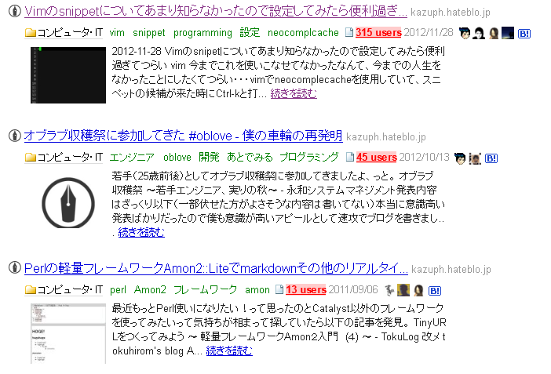

# 僕と僕のはてブとgithubとVimの付き合い方
@kazuph

2012/11/30

#### 自己紹介

## 自己紹介
* ID:@kazuph
* 「かずふ」って読みます
* 2年目エンジニア
* プログラミングは大学から
* 使用言語：Perl, Objective-C, JavaScript, Java
* エディタ: Vim
* 最近はスマフォアプリつくってます。

## ググればたくさん出てきます

#### 僕 と はてブ

## 直近
Vimの記事で100はてブ越えました!

## はてブとは？
 * はてブ＝はてなブックマーク
 * おそらく日本のエンジニアが最もよく使っているブログ＆ブックマークサービス

## 僕のはてブ歴
[http://b.hatena.ne.jp/entrylist?sort=count&url=kazuph.hateblo.jp](http://b.hatena.ne.jp/entrylist?sort=count&url=kazuph.hateblo.jp "ninki")

### だからなんなの？

## はてブ歴からその人がわかる

## はてブは戦闘力
* はてブされたことがない＝戦闘力0ではないけど
* まわりから見てわかりやすい指標になる

例

-> 「Vim戦闘力200！しかもまだまだ上がっている…だと！？」
-> 「Perl戦闘力…たったの13か…ゴミめ」

## 晒されるデメリット
* 数値化されてしまうことで実際の能力よりも低く見られてしまうかもしれない
* ネットで炎上してとりかえしのつかないことになるかも・・・？

## 晒されるメリット
* ネットで公開されているので世界中の人の目に届く
* それによって喜ぶ人がいるかもしれない

### 公開するとすごい人達に鍛えてもらえる可能性がある！

### エンジニアにとって 「公開する」と言えば

#### 僕 と github

## githubとは？
 * gitとSNSが融合したサービス
 * 世界中にコードを公開した状態で開発を行うことになる
 * (プライベートでもあるけど)
 * オープンソースソフトウェアや各種ライブラリの開発なども行われてる
 * 最近だとブログなどプログラム以外を公開することに用いられている

## 何がわかるの？

## 何がわかるの？
* その人が管理しているソースコード
* その開発履歴
* フォロー/フォロワー関係など
* あとコミットログなどがTLに流れてくる

## 僕とgithub
社内会議用タイマー

[http://kazuph.github.com/TeiClock/](http://kazuph.github.com/TeiClock/ "timer")

## 僕とgithub
iPhoneアプリのサンプル

[https://github.com/kazuph/TableViewALAssetsLibrary](https://github.com/kazuph/TableViewALAssetsLibrary "iphone")

## 僕とgithub
Perlのネット上での実行環境

[https://github.com/kazuph/PerlPad](https://github.com/kazuph/PerlPad "perlpad")

## 僕とgithub
プログラミング部のサイト

[https://github.com/gx-hackers/studio-256bit](https://github.com/gx-hackers/studio-256bit "perlpad")

## 僕とgithub
この資料

[https://github.com/gx-hackers/studio-256bit](https://github.com/gx-hackers/studio-256bit "perlpad")

## 僕とgithub
* ProjectEuelrをひたすら解いているだけのリポジトリ
* 自分のVimとかターミナルの設定を上げているリポジトリ
* 専門書の写経用リポジトリ
* etc.

## 僕とgithubとvim
