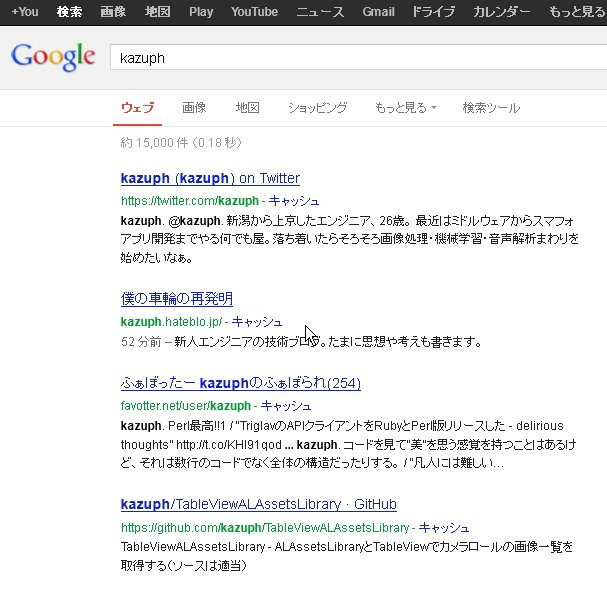
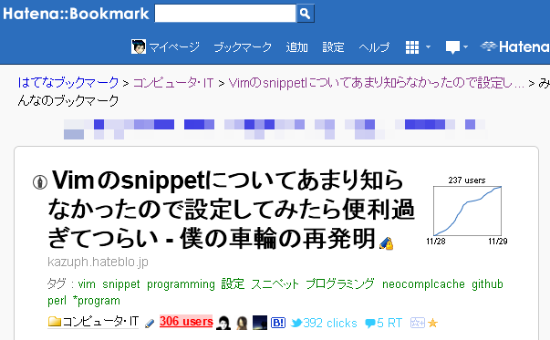
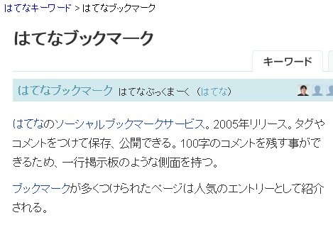
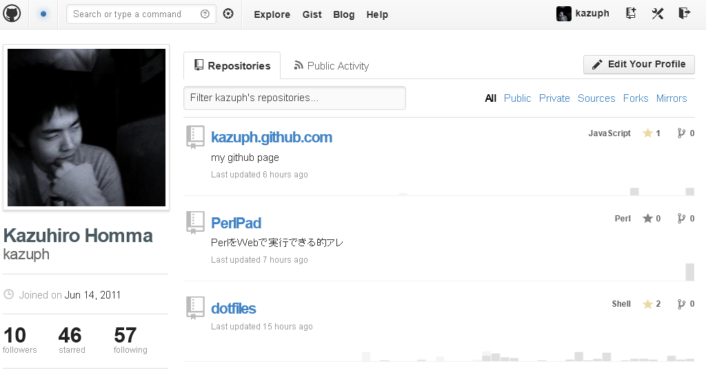

# 僕と僕のはてブとgithubとVimの付き合い方
@kazuph

2012/11/30

#### 自己紹介

## 自己紹介

* ID:@kazuph
* 「かずふ」って読みます
* 2年目エンジニア
* プログラミングは大学から
* 使用言語：Perl, Objective-C, JavaScript, Java
* エディタ: Vim
* 最近はスマフォアプリつくってます。

## ググればたくさん出てきます

#### 僕 と はてブ

## 直近
* Vimの記事を書いたらたくさん「はてブ」もらえました！

## はてブとは？
 * はてブ＝はてなブックマーク
 * おそらく日本のエンジニアが最もよく使っているソーシャルブックマークサービス

## 僕のはてブ歴一覧
[http://b.hatena.ne.jp/entrylist?sort=count&url=kazuph.hateblo.jp](http://b.hatena.ne.jp/entrylist?sort=count&url=kazuph.hateblo.jp "ninki")

### だからなんなの？

## はてブ歴からわかる人となり

### 自称でなく他人から後押しされた証拠があるということ

## はてブ数＝戦闘力
* まわりから見た場合の分かり易い指標
* （はてブされたことがない＝戦闘力0ではないけどね）

例

-> 「Vim戦闘力300！しかもまだまだ上がっている…だと！？」
-> 「Perl戦闘力…たったの13か…ゴミめ」

## 晒されるデメリット
* 数値化されてしまうことで逆に低く見られてしまうかもしれない
* ネットで炎上してとりかえしのつかないことになるかも？w

### 逆に

## 晒されるメリット
* ネットで公開されているので世界中の人の目に届く
* 自分より実力の上の人からフィードバックをもらえるかもしれない
* そのやりとりから何かを得て喜ぶ人がいるかも

### 「公開」するとすごい人達に 鍛えてもらえる可能性も！

### エンジニアにとって 「公開する」と言えば

#### 僕 と github

## githubとは？
 * ネット上でソース管理ができるサイト
 * ＋SNSが融合したサービス
 * 世界中にコードを公開した状態で開発を行うことになる

### 世界中の開発者のコードを見ることができる

### 世界中の開発者達のやりとりを見ることができる

### 逆に自分がその一員にも なれるかもしれない

### そんな素敵な サービスです

## 僕とgithub 1
[社内会議用タイマー](http://kazuph.github.com/TeiClock/ "timer")

* github単体で動作（サーバーいらない

## 僕とgithub 2
[iPhoneアプリのサンプル](https://github.com/kazuph/TableViewALAssetsLibrary "iphone")

## 僕とgithub 3
[Perlのネット上での実行環境](https://github.com/kazuph/PerlPad "perlpad")

* 動作はdotcloudで

## 僕とgithub 4
[プログラミング部のサイト](https://github.com/gx-hackers/studio-256bit "perlpad")

* github単体で動作（サーバーいらない

## 僕とgithub 5
[この資料](https://github.com/kazuph/kazuph.github.com/tree/master/presentation/github_hatena_twitter "kore")

* github単体で動作（サーバーいらない

## 僕とgithub 他にも色々
* 自分のVimとかターミナルの設定
* その他の発表資料
* 技術系の専門書を写経したコード
* etc.

### そう何気なくVimの設定をあげていたら・・・

#### 僕 と Vim

## vimとは
* Vimはテキストエディタ
* vimrcとはvimの設定ファイル
* 人によって設定ファイルの行数の違いや個性がある

## 突然の連絡！

## ！

## 快諾？

## vimrc読書会
* vim仙人が出没して教えを請う場所
* vim界の登竜門（たぶん、かな？ちがうか
* 初級Vimmerの自分としてはかなり畏れ多い場所・・・

## vimrc読書会に参加

## 沢山の凄腕Vimmerにdisられる
チャットルームの様子

## vimrc読書会終了

###  「人は叩かれて 成長する。」

### 公開したらすごい人達に鍛えてもらえた！

### まったく予期していないイベントだったけど、

### githubに公開してなかったら参加できなかったイベント

### 公開することで 広がる縁

### 「自分」を公開していて良かった！

## まとめ(エンジニアとして)
* ブログを書こう、githubにコードを上げよう
* 車輪の再発明は恐れず、今の成長途中の「自分」を公開しよう
* 結果はネットにゆだねよう
* 偶然の縁を大切にしよう

### Enjoy Your  Engineering Life!
### Thank you!
