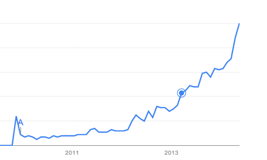

# GX::ASIA 2014

Kazuhiro Homma (@kazuph)

#section

## ME

- Kazuhiro Homma (Facebook)
    - kazuph (Please, google! Follow Me!)

## I am

- Web Engineer
- Smart Phone Application Engineer
- CPAN Author

## I made

- Base of community site (from scratch)
    - By using it, Diet community site and App (iPhone/Android)
- Blog service for business
- Matching Service (Now!)

## Thanks to this Experience,

## I can write...

-> Perl
-> Java (Android)
-> Objective-C (iOS)
-> Ruby

## Now, I am Studying...

- Docker
- Serf
- Ansible
- Golang

## My favorite

##### Vim

/#section

## Today

- Golang
- Japanese Engineer Culture

## Golang

- Open source programming language backed by Google
- Designed around simplicity, reliability, and efficiency

## Google Trend

## Golang main character
Gopher

## DEMO

- Creating Simple Web App
- Comparing with Sinatra (Ruby's WAF)
- Cross Compile

## Golang SUGEEEE! (is great)

## Next

## Japanese Engineer Culture

## 2 topics

-> 1. The Engineer Community
-> 2. The Famous Podcat

#section

## 1. The Engineer Community

## very dense tightly-coupled

## also called familiarity

## Famous Engineers

[Japanese Famous Engineers List](http://d.hatena.ne.jp/ishikawam/20111024/p1)

## They twitter each other,
## during work.

## What they speak about?

- OpenSSL bug?
- PyPy.js faster than CPython
- Docker is disposable Infrastructure
- etc.

## You can get  the up-to-date information  very easily!
## during work.

/#section

#section

## 2. The Japanese Famous Podcast ;)

## This is

## Miyagawa's Podcast

## Miyagawa's Podcast

- Miyagawa is one of the most famous Engineers in Japan
    - Started Podcast from a year ago
    - about
        - the up-to-date information
        - his experience for 20 years
        - his co-worker (He live in US)
        - Expert interview

## His Podcast is invaluable!!

## On the other hand

## English Podcast is a lot

- [37signals podcast](http://37signals.com/podcast)
- [the changelog](http://thechangelog.com/)
- [accidental tech podcat](http://atp.fm/)
- etc.

## Very Useful!

## I study Einglish by listening it...

/#section

## Summary

-> 1. Golang SUGEEE!
-> 2. Twitter is Very Convenience for aggregate information.
-> 3. I Thought I'd study English hard... (Podcast is great!)

## Thank you

