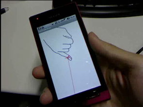
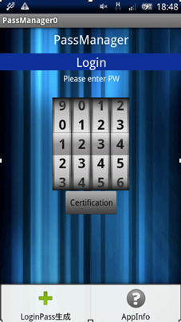
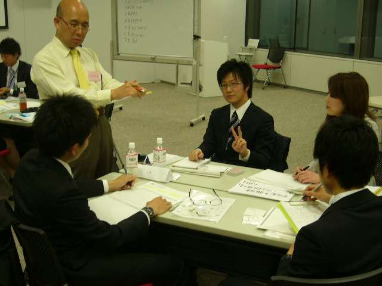
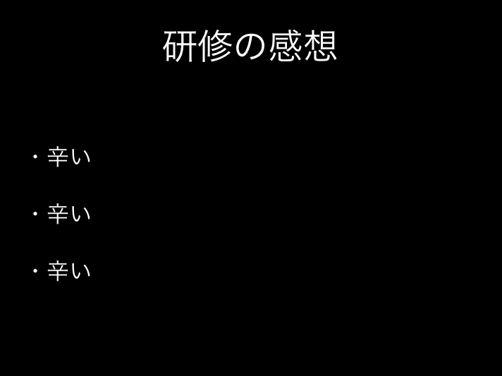
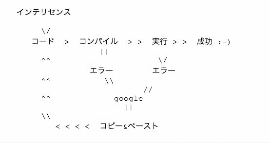

# 新卒エンジニア研修2013

キックオフ資料

新卒研修運営チーム

2013/04/12

##### まずは入社おめでとう！！
##### これから研修の説明をするよ！！
##### 3ヶ月後には君たちは
## こんな感じになってるはず①
君らが

## こんな感じになってるはず②
俺らが

##### ということで

##### 地獄の研修編 スタート！！

## Agenda
- 今までの研修
- 今回の研修
- 特訓の説明
- スケジュール
- ワーク
- 最後に

#### 今までの研修
## 今までの研修
- 今までの研修
    - 社外での座学研修
    - 自由につくったアプリ開発

## 今までの研修
- よかった部分
    - 営業の同期と絡めて一緒に何かをつくれた
    - かなり自由奔放にやった

## 今までの研修
Androidアプリ開発①

## 今までの研修
Androidアプリ開発②

## 今までの研修
Androidアプリ開発③

実際にGooglePlayに載ってます

## 今までの研修
営業の同期との交流

## 今までの研修
自由奔放なやつ

## 今までの研修
- だめだった部分
    - つまらなすぎる座学
        - 以前の新卒は野生児が多い
    - 内容が実務と乖離していた
    - 社外だと社内の人から教わることができない

## 今までの研修
某T氏の研修発表会のスライド

## 今までの研修
- 結果
    - チーム配属後に学習しなければならないことが多かった
        - チームによっては教育が負担になる
    - 本人も何を学べばいいかのかわからず苦戦する
    - 即戦力となるような実践はつめなかった

## 某S藤氏の言葉
「こんな形で出鼻をくじかれるとは思わなかった」

<s>※某S藤氏のキメ顔写真</s>

#### コラム① そもそも研修とは
## 研修とは
- 最後のモラトリアムか？
- こなすものか？
- 教えてくれなかったらできない？
- 失敗はない？安全？

教えません、ですが考えて見て下さい

## 研修とは？
>なぜ企業が給料を払ってまで生産性がなく学習だけの時間を新人に使うことを許すのかということを今この瞬間考える

##### これが終わったら新人じゃないんだ

#### 今回の研修

## 今回の研修
- 運営メンバー
    - H間、Y峯、T野、S藤、T梨
- メンター
    - 各自のチームリーダー

## 今回の研修
- 方針
    - 社内(部室)でやることで日々社員と交流できる
        - 対面, Skype, IRC
    - 実務の内容の縮図を体験する
    - 知識は実践で覚える
    - ggrks

## 今回の研修
- やること
    - 特訓
    - アプリ開発
        - 実践に即した内容でやる
        - 今はまだ内緒だよ☆

#### コラム② プログラマーになる方法

## プログラマーになる方法

[出展：プログラマーになる方法 | www.aoky.ne](http://www.aoky.net/articles/leon_bambrick/howtobeaprogrammer.htm "プログラマーになる方法 | www.aoky.ne")

##### ある意味真理

## プログラマーになる方法（補足）
- ggrks(大事なことなので２回ry)
- コピー＆ペースト
- 自分なりの書き方に修正する
- 書いたコードを上から順に説明できるようにする
- 先人からレビューしてもらう
- 人のコードを読む、レビューする

##### 巨人の肩の 上に乗れ

#### 特訓
## 特訓説明①
- 主旨
    - 実務でやることを先取りする
    - 独学ではやらないことを散りばめる
    - 必要な単語は並べてあげる
    - 各自で調べて提出する

->  そもそもこの特訓をやるには・・・？ という考えを大切にしてください

## 特訓説明②
- 配布した特訓シートに基づいてやる
- やるスケジュールは各自で決めること
- ハッカソン前には配布分は終わらせてね☆

## 特訓説明③
- 質問方法
    - わからないことは弊社開発陣に#zakkyoで質問
    - (特訓|アプリ)の指示の内容などは運営チームに#EngKensyuに質問
    - 進め方などはメンターに相談
    - その他は口頭で相談

#### コラム③<br/ >プログラマー 三大美徳
## プログラマー三大美徳
-> 怠惰
-> 短気
-> 傲慢

## プログラマー三大美徳
- 怠惰
    - 「楽をするための苦労を惜しまない」
- 短気
    - 「俺がこんなに大変なのにコンピュータが楽をしてるのが許せない」
    - 「ついカッとなってやった、後悔はしていない」
- 傲慢
    - 「自分がつくったものがすごくないわけがない」
    - 「使いづらいわけがない、拡張性がないわけない…」

##### 無駄な作業をしていると思ったら思い出そう！

#### スケジュール
## 全体スケジュール
- 4月12日 キックオフ→特訓開始
- 4月17日 MAXアワードキックオフ（他社との合同ハッカソン）
- 4月22日-25日 MAXアワード
- 以降アプリ製作開始(特訓と平行)
- 6月末 研修修了

ハッカソンは営業の同期とも一緒に行う

## 一日のタイムスケジュール
- 09:00〜 朝礼、メンターとのMTG、その後部室へ
- 09:30〜 特訓開始
- 12:00〜13:00 お昼
- 13:00～ 研修運営チームの見回り
- 13:30～18:00 特訓続き（ハッカソン後はアプリ制作
- 18:00～ 希望者は補修

※このスケジュールは提案です

#### ワーク
## ワーク
- 偽評価制度(QCP)
    - 実際の給与交渉の超簡易的な縮図
    - これでどうこうしないです
    - 多分給料には影響しません

## ワーク
- あなたに取って研修とはなんですか？

>　 
>　 
>　 
>　 
>　 
>　 
>　 
>　 
>自由に記入

## ワーク
- あなたが研修中に成し遂げたいことはなんですか？

BESTケースを記入して下さい

>　 
>　 
>　 
>　 
>　 
>　 
>　 
>　 
>自由に記入

## ワーク
- 研修への意気込みを記入してください

>　 
>　 
>　 
>　 
>　 
>　 
>　 
>　 
>自由に記入

#### 最後に
##### もしも困り果てて
##### どうしようもないと思ったら
##### 周りを見渡してみよう
##### きっと
## 
出展：ワンピース第60巻 p122より

## Enjoy KENSHU!

