# Vim実践入門 ~Perl編~

YAPC::ASIA 2013 9/20 at 慶応大学

株式会社GaiaX Kazuhiro Homma (@kazuph)

#section

## Whoami


- @kazuph / 本間 和弘(Kazuhiro Homma)
- Web&SmartPhone Engineer / 株式会社ガイアックス
- [社内でCPAN Authorになろうハッカソンを開催しました！！](http://kazuph.hateblo.jp/entry/2013/06/16/235744)
- [Vimのsnippetについてあまり知らなかったので設定してみたら便利過ぎてつらい](http://kazuph.hateblo.jp/entry/2012/11/28/105633)

## Whoami
去年の素数戦争の企画・運用をやってました


ガイアックス × CodeIQ

[Yapc::Asia2012::素数戦争(PrimeWars)](http://yapc.pjeuler.com/dir/yapc2012)

### 言語別開発環境

- メモ(日本語)
    - GVim
- Perl
    - Vim
- iPhone / Objective-C
    - XCode + XVim
- Android / JAVA
    - Eclipse + Vimperator
- Chrome
    - Vimium

### chrome-vim-cheatsheet

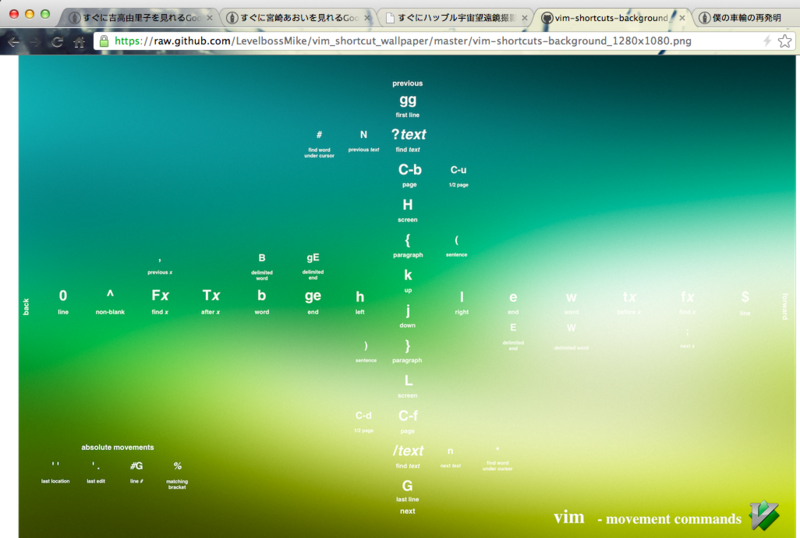
[すぐにVimチートシートを見れるGoogle Chromeの拡張作った。](http://kazuph.hateblo.jp/entry/2013/02/13/011525)

### 完全なるVimmerです


/#section

#section

### 発表することになったきっかけ
### typestarさんのEmacsの発表


### 本当にすいませんm(_ _)m

### まさかの裏番か・・・！？


## [エディター宗教戦争](http://ja.wikipedia.org/wiki/%E3%82%A8%E3%83%87%E3%82%A3%E3%82%BF%E6%88%A6%E4%BA%89)

### 回避！

裏番組にするのは回避されました！！


### 本当にありがとうございました！！１

/#section
#section
## 対象

- Vimを使ったことがないけど興味はある
- 使ってみたけど挫折した
- もう一度Vimを基礎から勉強し直したい
- Vimのプラグインに手を出すことに二の足を踏んでいる
- そういえば他人がVimを使ってる光景をあまり見たことがない
- etc...

## !!注意!!

※Vimの基礎からは扱いますが初心者向けの速度で発表しません。

※vimtutorを済ましてると理解が捗ると思います。

## 非対象

Vim戦闘力が1000以上

[参考][Vimの戦闘力を計測する](http://vim-users.jp/2009/07/hack-39/)

/#section
#section

### 今日発表しないこと
### Vimの中でシェルを実行

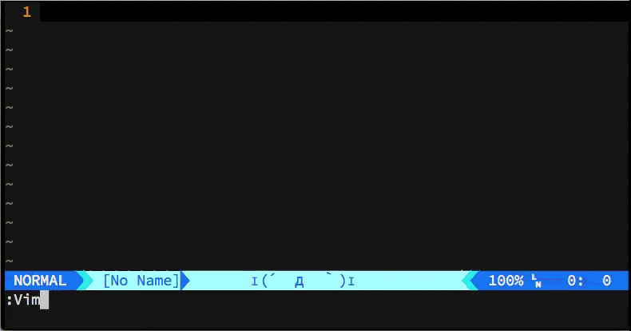

### 暗黒美夢王(ダークネスヴィムマスター)
[バトルエディターズ 第1話：彼の名は暗黒美夢王](http://vinarian.blogspot.jp/2013/05/1.html)


### Vimで走り幅跳び


### っていう話はしません！

/#section
#section

### 今日のモチベーション
### 「動いているVim」と「検索ワード」を@@覚えて帰ってもらう
### 発表後でも学ぶことができるスライド
/#section

### あじぇんだ
- Vim（自体について）
- Vimの基礎(モード・移動・編集・デフォルト機能)
- VimPlugin(拡張・補完・その他便利な機能)
- VimとPerl

#### Vim

#section

### Vimとは？
- 作者…オランダ人のプログラマーBram Moolenaarさん
- Vi IMproved(viの改良版)で略してVim
- 対応OS
    - Unix系、Windows、Mac、Android、iPhone
- 発表現在(2013/09/20)のバージョン…7.4
    - 発表の内容は以降特に断りなく最新版のVimを使っている前提で話します
- 特徴
    - モードという概念がある
    - ショートカットを覚えるのにものすごい記憶力を必要とする
    - 初心者のやる気を削ぐ

### その他の特徴

### 2012年のAdventCalendarが終わらない
現在290日以上継続中・・・！！


- [Vim Advent Calendar 2012](http://atnd.org/events/33746)

### ネット上の情報の多さが圧倒的


googleトレンド調べ

### Vimの話題を日本語で

[Linger - vim-users.jp](http://lingr.com/room/vim)


[自分もvimrc読書会でdisられたりしました](http://lingr.com/room/vim/archives/2012/11/10#message-12888729)

### その他情報ソース
詳しくはWebで

[Hachioji.pm 日めくりテックトーク](http://hachiojipm.github.io/entry/2013-09-11-01.html)

## Vimの情報は周りに溢れているので安心して使ってください。

/#section

#### Vimの基礎（前半戦）
⎋:Esc,  ⌃:Ctrl,  ⇧:Shift,  ⇥:Tab

### Vimの基礎の内容
- インストール方法
- vimrc
- モードの話
- ファイル開閉
- 移動
- インサートモードモード
- ビジュアルモード
- オペレーター
- モーション
- テキストオブジェクト
- 検索・置換
- ファイル間移動(gf, ctags)
- Exコマンド/外部コマンドの実行

### Vimのインストール方法
- Mac
    - [macvim-kaoriya](https://code.google.com/p/macvim-kaoriya/)よりダウンロード
- Win
    - [香り屋さんVim](http://www.kaoriya.net/software/vim/)よりダウンロード
- Redhat系
    - 以下のコマンドよりインストール

        ```
        sudo yum install vim-enhanced
        ```
- Debian系
    - 以下のコマンドよりインストール

        ```
        sudo apt-get install vim-full
        ```

#section
### Vimの設定ファイルについて
基本的にはこの場所
$HOME/.vimrc

※Windowsの場合は\_vimrcがあると先に読み込まれる

### vimrcを瞬時に開く

ショートカットを設定

```
" .vimrcを瞬時に開く
nnoremap <Space><Space>. :e $MYVIMRC<CR>
" vimrcの設定を反映
nnoremap <Space><Space>.. :<C-u>source $MYVIMRC<CR>
```

/#section
#section
### Vimのモード

Vimには大きく分けて4つのモードがある

### Vimのモード

- ノーマルモード…基本のモード。移動やコピペ、削除、他のモードへの移行ができ、Escキーなどでいつでも戻ってこれる。

@@

- インサートモード…入力できるモード。いくつか編集を楽にするためのショートカットも使用できる。

@@

- ヴィジュアルモード…テキストを選択して、コピー(yank)したり削除したりできる。コマンドモードとの連携もできる。

@@

- コマンドモード…保存や終了、検索、置換、その他便利なコマンドを使用して編集ができる。

### モードが分かれていることについて
- 良い点
    - それぞれのモードにプログラマが集中できる
    - キーバインドがシンプルになる
        - 小指つらいを回避
- 悪い点
    - 直感的じゃない(非人間的)
    - 記憶力・慣れが必要(学習障壁が高い)
    - 初心者殺し

### Vimは「慣れ」れば高速！！
### プログラマーの最強の武器「Vim」を@@使いこなしましょう！

/#section

### ここから基本コマンドの説明

### ファイルを開く、保存、終了

コマンドラインで

```
$ vim <filename> # 複数ファイルなら vim *.pm
```

でファイルを開く

@@

保存 `:w`, 終了 `:q`, 保存と終了 `:wq`

#section
### ノーマルモードでの移動方法
カーソルキーだめです

### 上下左右

`hjkl` を使う

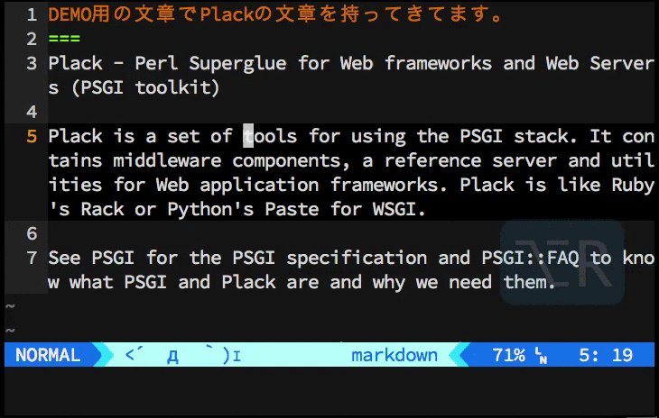

### 単語ごとに移動

次の単語の先頭 `w`, 次の単語の末尾`e`, 前の単語の先頭 `b`


### ファイル先頭・ 末尾
\<HOME\>キー、\<END\>キーを使わない

行の頭へ移動する `0`,
文章の頭へ移動する `^`,
行末へ移動する `$`


### その他


※`:se nu`で行番号を表示する

### 「慣れ」れば高速

/#section

### インサートモード

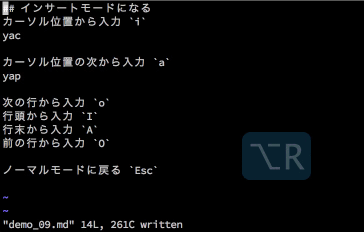

※`Esc`は `Ctrl + [` で代用できる
※⎋:Esc

#section
### ヴィジュアルモード

文字選択 `v`,
行選択 `Shift+v`,
矩形選択 `Ctrl+v`


※⎋:Esc


### オペーレーターと組み合わせる

削除 `d`,
置き換え `c`,
コピー（ヤンク）`y`,
ペースト`p`

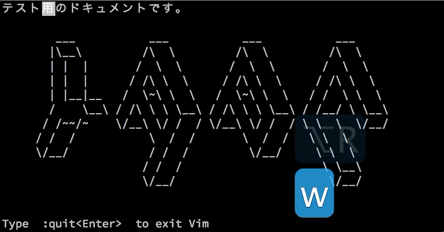
/#section

### オペレーターとモーションの組合わせ
例えば削除の場合

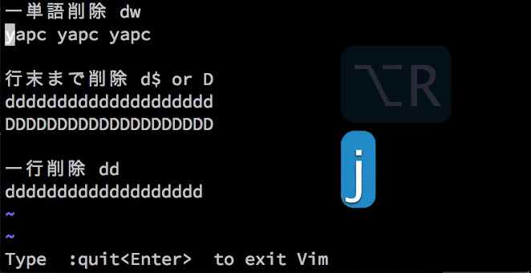

※`.`は直前の操作を繰り返してくれる

### テキストオブジェクト
文字の塊を操作する
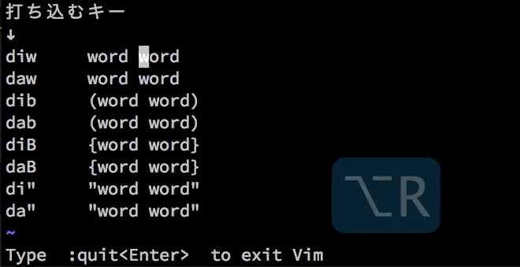

### 取り消しと(取り消し)^2


#section
### 検索
デフォルトが微妙なのでvimrcを設定

### 検索用vimrc
下の設定をvimrcに書くことで、検索結果をハイライトし、@@大文字小文字の区別を無視してくれる。

$HOME/.vimrc

```
" 検索語を強調表示
set hlsearch

" 検索時に大文字・小文字を区別しない
set ignorecase

" ただし、検索後に大文字小文字が
" 混在しているときは区別する
set smartcase
```

## DEMO

`/<検索したい単語>` , `*`でカーソル下の単語を即時検索`


※ハイライトの解除は `:nohl`

/#section
#section
### 置換
`:%s/<置換したいワード>/<置換後のワード>/gc`

`%`は「文章全体」という意味


### Visualモードと組み合わせる
選択部分だけに対して置換が行える


/#section
#section
### ファイル間移動

ファイル名の場所で `gf`


※`Ctrl+o`で前ファイルに戻る、`Ctrl+i`で進む

/#section
#section

### ctags
Package名部分 or メソッド名部分で `Ctrl+]` とすることで、@@定義箇所へ移動することができる

予めプロジェクト直下で以下のコマンドを実行する必要がある

```
ctags -R
```

### DEMO


/#section
#section
### Exコマンドの実行
Exコマンドを実行 `:<Exコマンド>`,

例) 文章全体をソート `:%sort`,
選択範囲をソート `:'<,'>sort`

### 文章をsortしてみる
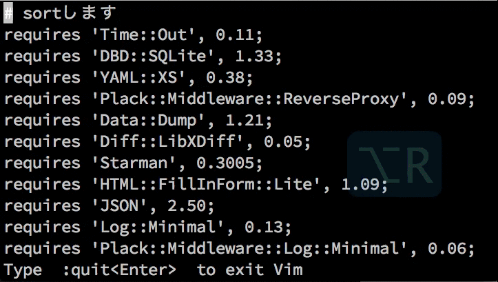

cpanfileをソートするときとかに便利

/#section

#section
### 外部コマンドの実行
外部コマンドを実行 `:!<外部コマンド>`,

例） `:!ls`, `:%!sort`, `:'<,'>!sort`

例えばgitコマンドやperlのワンライナーとかも普通に実行できます

### awkとcutでモジュール名だけ抽出する
cpanfileを例に
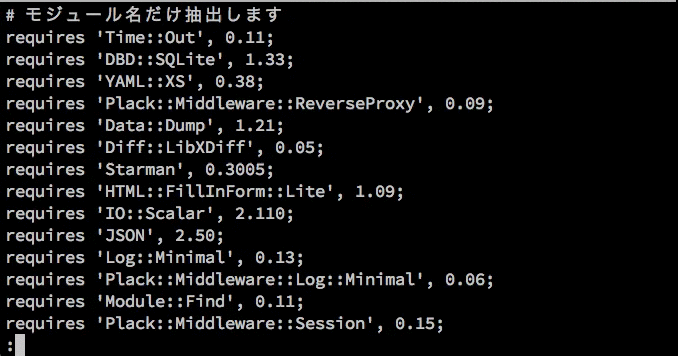


/#section

### まだまだ紹介したりませんが、
### Vimの標準機能だけですでに色々なことができることがわかったと思います。
#### VimPlugin(後半戦)
⎋:Esc,  ⌃:Ctrl,  ⇧:Shift,  ⇥:Tab
### VimPluginの内容
- Vim全般
    - pluginの管理方法
    - 加速させられたjk
    - 瞬時に目的のファイルを開く
    - キャメルとスネーク
    - 処理の実行
    - ドキュメント
    - シンタックスチェック
    - 補完・スニペット
- VimとPerl
    - オムニ補完
    - バリデーション
    - Perlのシンタックスハイライト
    - テキスト整形
    - 文字入力
    - テストの実行

### VimPluginとは？

デフォルトのVimを更に便利にするもの。
Vimの機能拡張をするものからVimに新たなエコシステムを提供する巨大なプラグインまである。

#section
### bundleみたいにpluginを管理する
[NeoBundle](https://github.com/Shougo/neobundle.vim)

### NeoBundle導入
Vimプラグインを管理するためのプラグイン。

まずはNeoBundleをgit clone

```
$ mkdir -p ~/.vim/bundle
$ git clone git://github.com/Shougo/neobundle.vim ~/.vim/bundle/neobundle.vim
```

最低限の`~/.vimrc`の設定

```
set nocompatible
if has('vim_starting')
  set runtimepath+=~/.vim/bundle/neobundle.vim/
endif
call neobundle#rc(expand('~/.vim/bundle/'))

NeoBundle '...'

filetype plugin indent on
syntax on
NeoBundleCheck
```

### インストールしたいプラグインの記述

例えばvimprocというプラグインをインストールしたい場合

```
git@github.com:Shougo/vimproc.vim.git
```

`git@github.com:`の部分を省略できる

```
NeoBundle 'Shougo/vimproc'
```

### プラグインのインストール

コマンドモードで `:NeoBundleInstall`

もしくは `NeoBundleCheck` を記述しているなら

起動時に半自動でインストール可能

ちなみにアップデートは `:NeoBundleUpdate`

/#section
### とういことでここから@@いくつか便利なプラグインを紹介
NeoBundleInstallしてる前提で話します

#section
### 加速させられたjk
[accelerated-jk](https://github.com/rhysd/accelerated-jk)

.vimrc設定

```
NeoBundle 'rhysd/accelerated-jk'
let g:accelerated_jk_acceleration_table = [10,5,3]
nmap j <Plug>(accelerated_jk_gj)
nmap k <Plug>(accelerated_jk_gk)
```

### DEMO

左：普通のjk, 右：加速されたjk

<span style="text-align:left">

</span>
<span style="text-align:right">

</span>

上下に高速に移動できる

/#section

### [実演]瞬時に目的のファイルを開く


[CtrlP](https://github.com/kien/ctrlp.vim)…
`Ctrl+p`を押すとファイルリストが開き、

曖昧な文字を入力しても目的のファイルを開ける。

```
NeoBundle 'kien/ctrlp.vim'
```

### キャメルケース


キャメルケースをスネークケースに置き換える

```
NeoBundle 'kana/vim-operator-user.git'
NeoBundle 'tyru/operator-camelize.vim'
nmap C <Plug>(operator-camelize-toggle)
```

### 様々な言語をVimから実行する

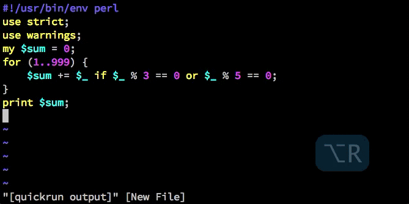

[quickrun](https://github.com/thinca/vim-quickrun) …
実行は `\r`

```
NeoBundle 'thinca/vim-quickrun'
NeoBundle "y-uuki/perl-local-lib-path.vim"
autocmd FileType perl PerlLocalLibPath
```

### ドキュメントを瞬時に引きたい

```
NeoBundle 'thinca/vim-ref'
```

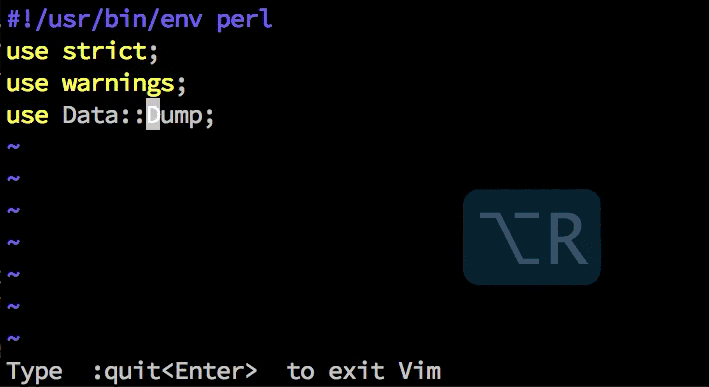
※別にPerl専用プラグインというわけじゃない

### syntaxチェックよろ

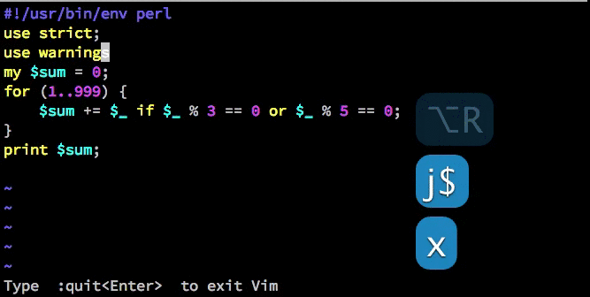

[syntastic](https://github.com/scrooloose/syntastic)
…保存時に自動でシンタックスチェックが走る

```
NeoBundle 'scrooloose/syntastic'
```

#section

### 補完を簡単にしたい

[neocomplete](https://github.com/Shougo/neocomplete.vim)

本来補完の機能はVim自体にあるが、

それをとても使いやすく提供してくれているもの

設定は長いので[gist](https://gist.github.com/kazuph/6590028)に上げました

### DEMO

入力中に自動で補完候補が表示される

/#section
#section

### スニペットで手抜きしたい
[neosnippet](https://github.com/Shougo/neosnippet.vim)…登録されているスニペットを補完候補に出し展開する支援をする

設定は長いので[ここ](https://gist.github.com/kazuph/6590028)を参照のこと

### スニペットファイル例

```
snippet #!
    #!/usr/bin/env perl
snippet sub
    sub ${1:function_name} {
        ${0}
    }
snippet map
    map {  ${0: body }    }  ${1: @array } ;
```

[honzaさんのperlのsnippet](https://github.com/honza/vim-snippets/blob/master/snippets/perl.snippets)

### DEMO


⎋:Esc,  ⌃:Ctrl,  ⇧:Shift,  ⇥:Tab

### 自分のオリジナルsnippetファイルを使う
設定

```
let g:neosnippet#snippets_directory='~/.vim/bundle/vim-snippets/snippets, ~/dotfiles/snippets'
```

すぐに開けるようにショートカットの作成

```
" snippets/perl.snipを瞬時に開く
nnoremap <Space><Space>ps :vs $HOME/dotfiles/snippets/perl.snip<CR>
```

/#section

#### VimとPerl
⎋:Esc,  ⌃:Ctrl,  ⇧:Shift,  ⇥:Tab

### オムニ補完
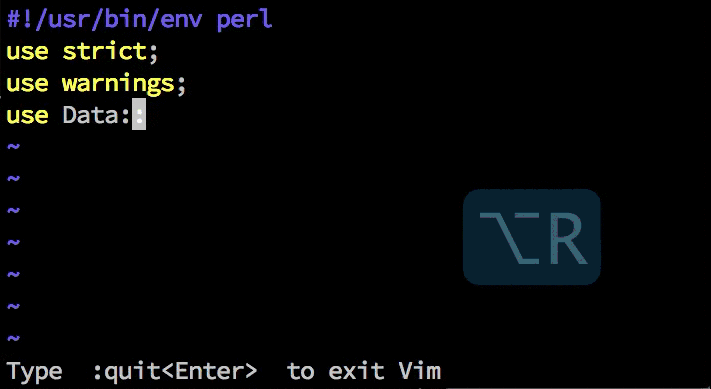

`Ctrl+x, Ctrl+o`でモジュール、メソッド候補を表示する

```
NeoBundle "c9s/perlomni.vim"
```

### ありがちなミスを防ぐ
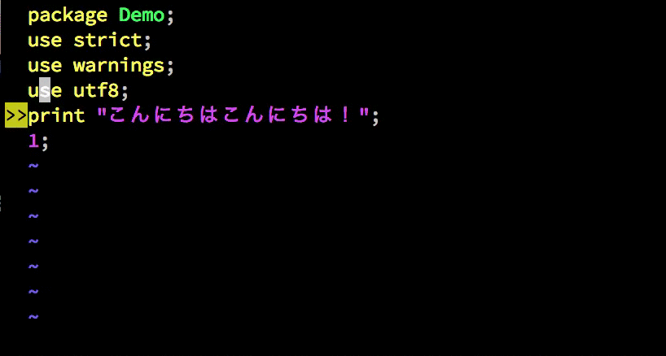

ファイルエンコーディングミス, パッケージ名間違い

```
NeoBundle "mattn/perlvalidate-vim.git"
```

[Windowsなperlユーザーも捗るみたいです](http://perl-users.jp/articles/advent-calendar/2011/casual/1)

### VimのPerlシンタックス力を強化

```
NeoBundle "vim-perl/vim-perl"
```

シンタックスハイライトの設定

```
augroup filetypedetect
    au BufNewFile,BufRead *.psgi    setf perl
    au BufNewFile,BufRead *.t       setf perl
    au BufNewFile,BufRead *.tt      setf tt2html
    au BufNewFile,BufRead *.tt2     setf tt2html
    au BufNewFile,BufRead cpanfile  setf perl
augroup END
```

※tt2htmlを使用する場合はvim-perlが必須

### 自動でテキスト整形させる
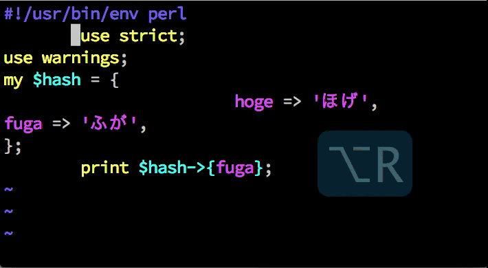

```
cpanm Perl::Tidy
```

```
nnoremap ,pt <Esc>:%! perltidy -se<CR>
vnoremap ,pt <Esc>:'<,'>! perltidy -se<CR>
```


### 入力しづらい文字を簡単に入力
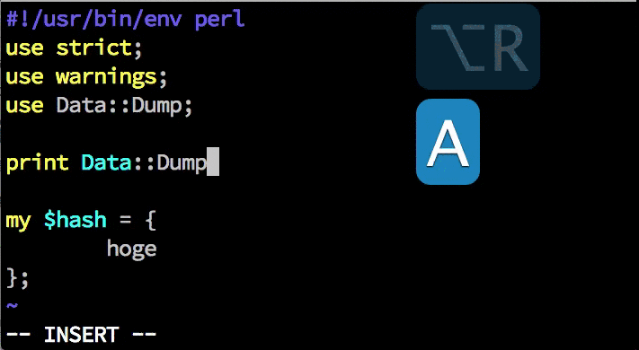

```
NeoBundle "smartchr"
inoremap <expr> ,  smartchr#one_of(',  ',  ', ')
autocmd FileType perl inoremap <buffer> <expr> . smartchr#loop(' . ', '->', '.')
autocmd FileType perl inoremap <buffer> <expr> = smartchr#loop(' = ', ' => ', '=')
```

### テストの実行

外部コマンドとしてprove実行でいいかな…


### [追加]gitでの差分を編集時に表示

```
NeoBundle 'airblade/vim-gitgutter'
```
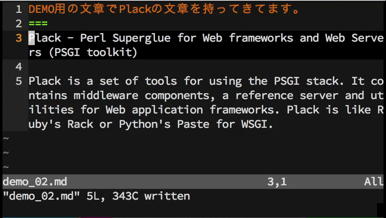

#### これから

### Vimを学べる本

この順番で目を通すと幸せになると思います。

1. [入門vi](http://www.amazon.co.jp/%E5%85%A5%E9%96%80vi-%E7%AC%AC6%E7%89%88-%E3%83%AA%E3%83%B3%E3%83%80-%E3%83%A9%E3%83%A0/dp/4873110831/ref=sr_1_5?s=books&ie=UTF8&qid=1379389009&sr=1-5&keywords=vim)

2. [実践Vim 思考のスピードで編集しよう!](http://www.amazon.co.jp/%E5%AE%9F%E8%B7%B5Vim-%E6%80%9D%E8%80%83%E3%81%AE%E3%82%B9%E3%83%94%E3%83%BC%E3%83%89%E3%81%A7%E7%B7%A8%E9%9B%86%E3%81%97%E3%82%88%E3%81%86-Drew-Neil/dp/4048916599/ref=sr_1_1?s=books&ie=UTF8&qid=1379389009&sr=1-1&keywords=vim)

3. [Vimテクニックバイブル　~作業効率をカイゼンする150の技](http://www.amazon.co.jp/Vim%E3%83%86%E3%82%AF%E3%83%8B%E3%83%83%E3%82%AF%E3%83%90%E3%82%A4%E3%83%96%E3%83%AB-%EF%BD%9E%E4%BD%9C%E6%A5%AD%E5%8A%B9%E7%8E%87%E3%82%92%E3%82%AB%E3%82%A4%E3%82%BC%E3%83%B3%E3%81%99%E3%82%8B150%E3%81%AE%E6%8A%80-Vim%E3%82%B5%E3%83%9D%E3%83%BC%E3%82%BF%E3%83%BC%E3%82%BA/dp/4774147958/ref=sr_1_2?s=books&ie=UTF8&qid=1379389009&sr=1-2&keywords=vim)

### 参考URL
- Perlについて
    - [VimmerなPerl開発環境](http://mattn.kaoriya.net/software/lang/perl/20100901231137.htm)
    - [Perlでアプリケーションをささっと書くのに役立つTips](http://perl-users.jp/articles/advent-calendar/2012/casual/1)
    - [vim で Perl を書くときのための tips](http://perl-users.jp/articles/advent-calendar/2012/casual/13)

- 今回の発表を実現するvimrc
    - [https://gist.github.com/kazuph/6590028](https://gist.github.com/kazuph/6590028)

### 最後に
### Vimはオープンソースであり
### チャリティーウェアです

### Vimがいいなと思ったら

### 　

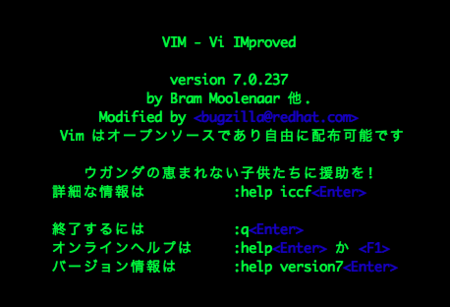

### ご清聴ありがとうございました!!!

